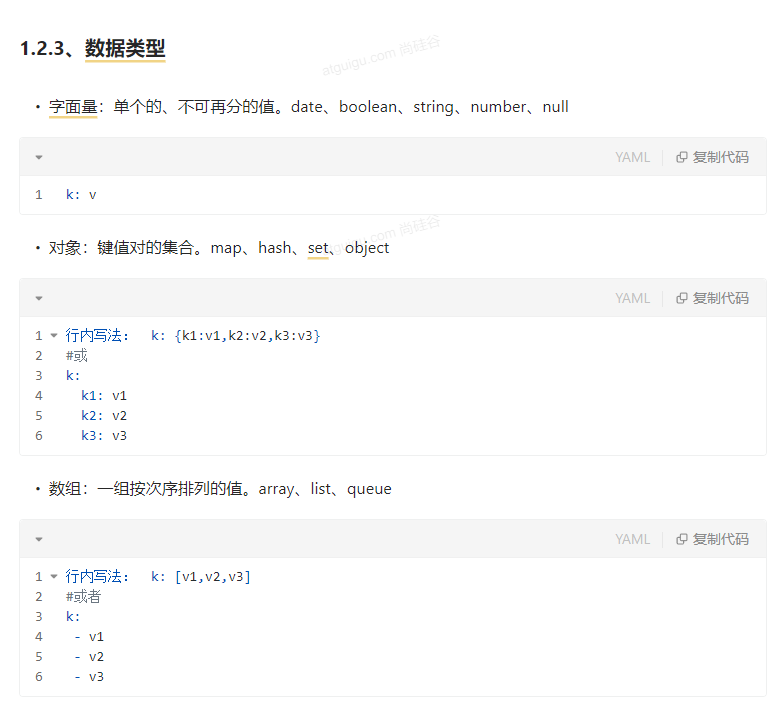

Spring Initailizr（项目初始化向导）
==
####0、选择我们需要的开发场景

  
####1、自动依赖引入  

)
####2、自动创建项目结构  

这是一个测试-图片显示

  
####3、自动编写好主配置类  
**强调**

#配置文件

##1、文件类型

###1.1、properties
同以前的properties用法
####1.2、yaml(亚麻)
#####1.2.1、简介
YAML 是 "YAML Ain't Markup Language"（YAML 不是一种标记语言）的递归缩写。在开发的这种语言时，  
YAML 的意思其实是："Yet Another Markup Language"（仍是一种标记语言）。 

**非常适合用来做以数据为中心的配置文件**
#####1.2.2、基本语法
●
key: value；kv之间有**空格!!!!!**  
●
**大小写敏感!!!!**  
●
使用**缩进**表示层级关系  
●
缩进不允许使用tab，只允许空格  
●
缩进的空格数不重要，只要相同层级的元素左对齐即可  
●
'#'表示注释  
●
字符串无需加引号，如果要加，''与""表示字符串内容 会被 转义/不转义  
#####1.2.3、数据类型  

#####1.2.4、示例
application.yaml文件
1.单引号会将＼n作为字符串输出;双引号会将＼n 作为换行输出<控制台打印>  
2.双引号不会转义，单引号会转义(再加斜杠)<网页上>
3.\被转译为\\\